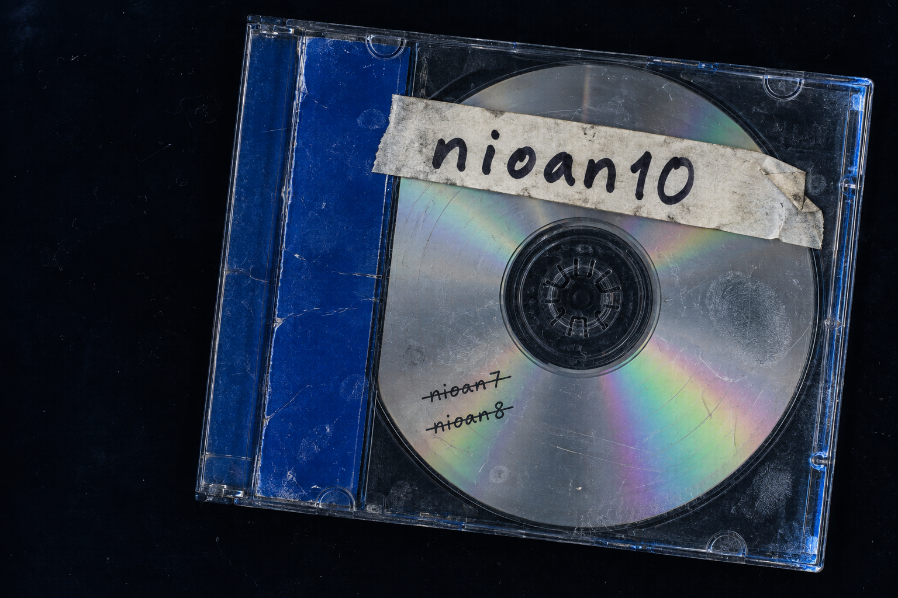

  

  <a href="https://github.com/nioan10/concordOS">concordOS</a>
  &nbsp;&nbsp;&nbsp;
  <a href="https://github.com/nioan10/digital-trace">digital-trace</a>
  &nbsp;&nbsp;&nbsp;
  <a href="https://github.com/nioan10/Cryptography-DES">Cryptography-DES</a>

  
  
  
  

  
  
  
  

  
  

